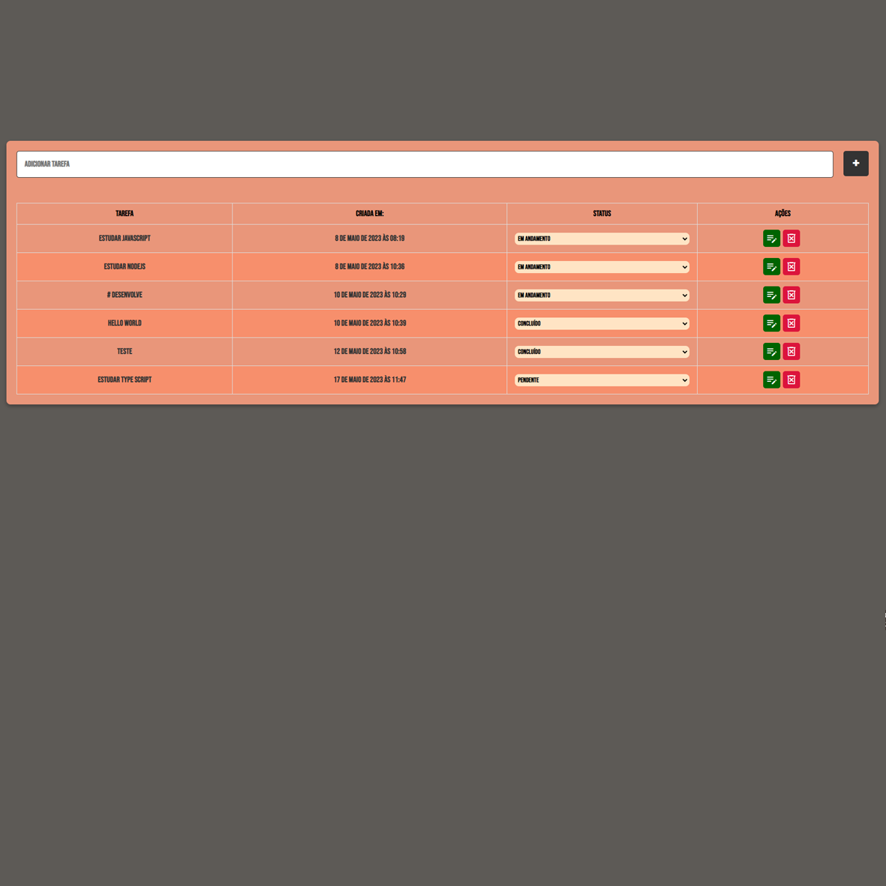

<h1>Projeto Full Stack em Desenvolvimento.</h1>

Lista de tarefas.

<h2>🐱‍👤Features:</h2>

- npm install express: Para oferecer soluções e gerenciar requisições de diferentes verbos HTTP, em diferentes URLs.

- npm install mysql2: Para instalar o pacote "mysql2" no projeto. É um driver de banco de dados MySQL que permite que você se conecte a um servidor MySQL e execute consultas SQL a partir do seu código Node.js.

- npm install nodemon: Para monitorar as alterações no código e reiniciar automaticamente o aplicativo Node.js quando detecta-las.

- npm install dotenv: Para configurar variáveis de ambiente com uma maneira mais seguro e fácil de gerenciar.

- npx eslint --init (configurações: To check syntax, find problems, and enforce code style + commonJS + sem react vue e typeScript )

- Docker: Para criar um contêiner que contenha o servidor MySQL e todas as dependências necessárias para executar o banco de dados.

- Cors: Para permitir que a aplicação seja executada em uma origem e acesse recursos de outra origem diferente.

NOTE:

- Abrir o docker e rodar o banco de dados mysql;
- Abrir um terminal para entrar no terminal mysql com o comando: mysql -u root -p
- Abrir outro terminal para conectar com o servidor e rodar o nodemon: npm run dev

<h2>🤖Tech:</h2>

</img>

<h2>🐱‍🏍Social media:</h2>

